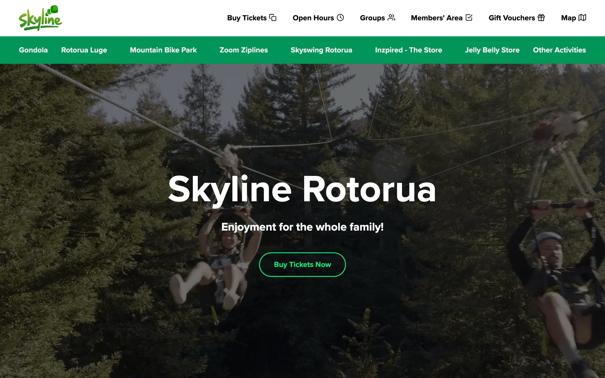
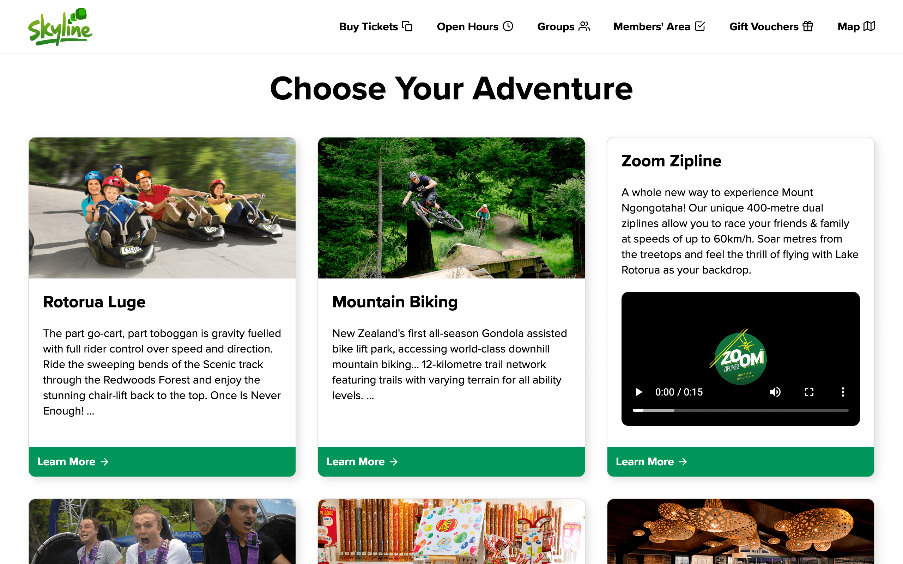
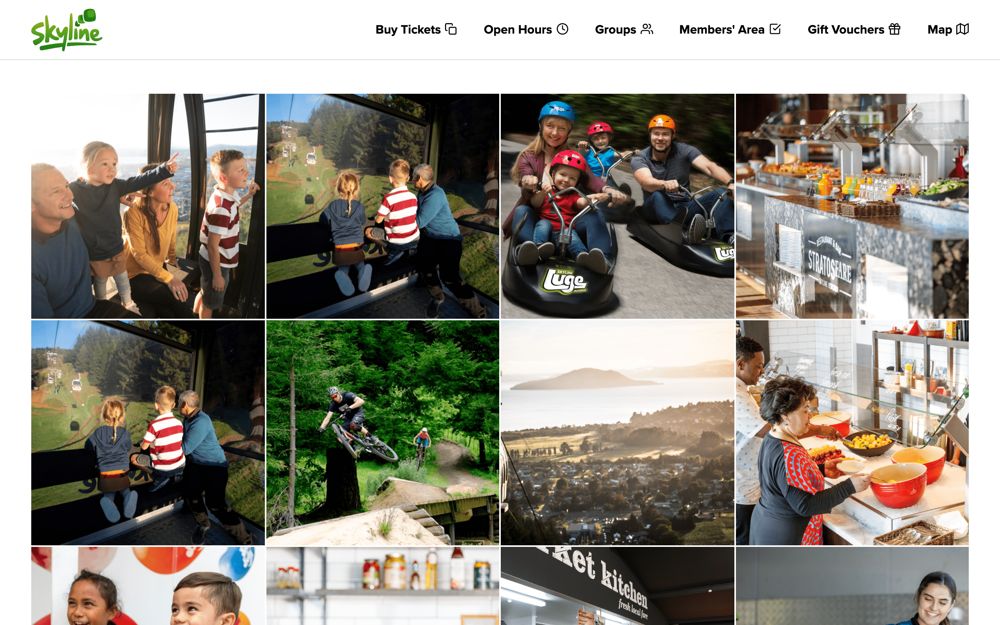
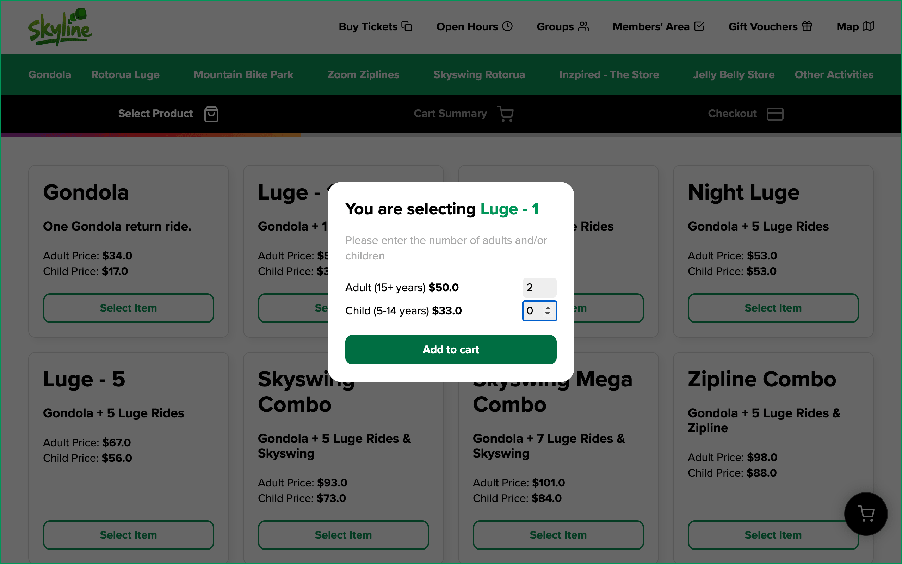
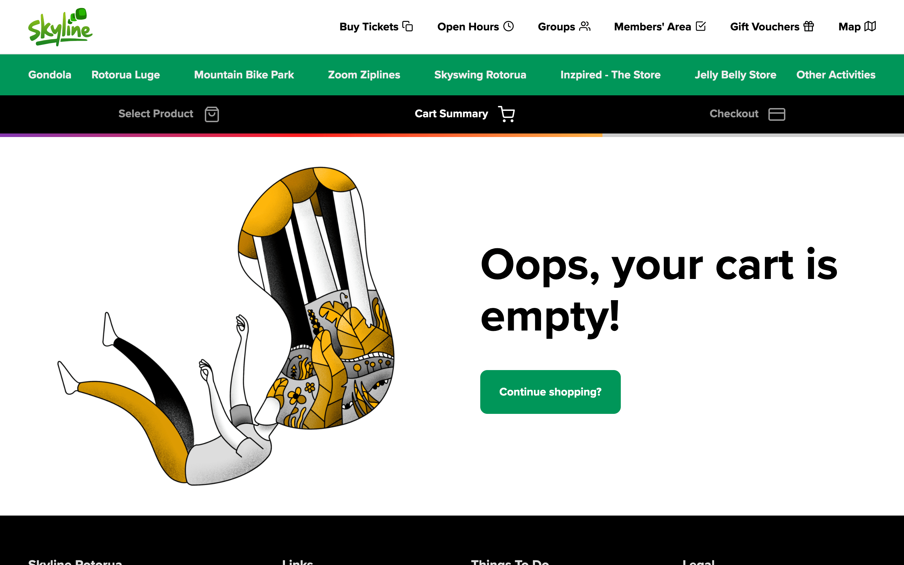
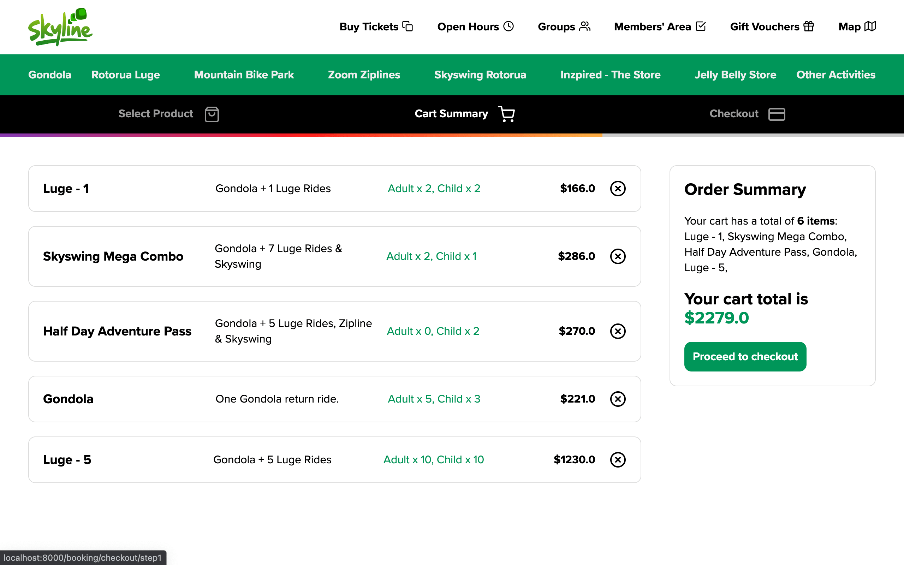
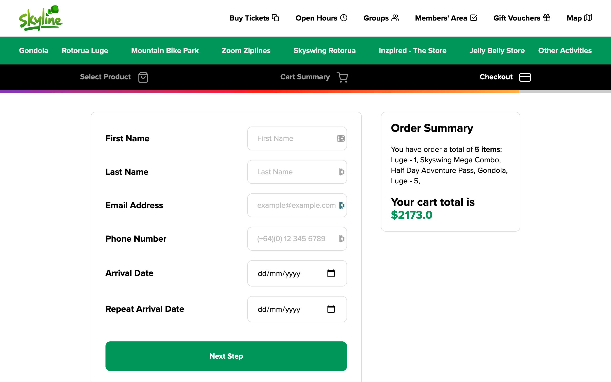
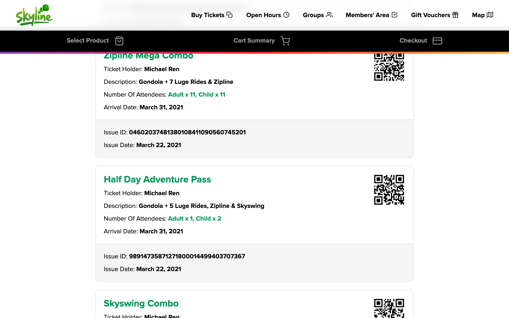

# Skyline Website Redesigned
For Level 3 DGT.

## Python virtual environment / Django setup on Mac 

```Bash
# Navigate to the project folder
cd Downloads
cd Skyline-Website
# Create a Python virtual environment
python3 -m venv .
# Activate the virtual environment
source bin/activate
# Install required Python packages
pip install -r requirements.txt
cd src
cd project
mkdir secrets && cd secrets
nano email_key.txt
# Set your email key
# ctrl-x, then y to save
nano project_key.txt
# Set a django secret key
# ctrl-x, then y to save
cd ..
nano settings.py
# Change EMAIL_HOST_USER = "michaelren.dev@gmail.com" to set your own email address
# ctrl-x, then y to save
cd ..
python manage.py makemigrations
python manage.py migrate
python manage.py createsuperuser
# Enter the required details
python manage.py runserver
# ctrl-x to stop
# Start a new terminal session, then
python manage.py process_tasks
# Go to localhost:8000/admin and login
# Add some activities in the Activity Table
# Go to localhost:8000 to view the site
```
















